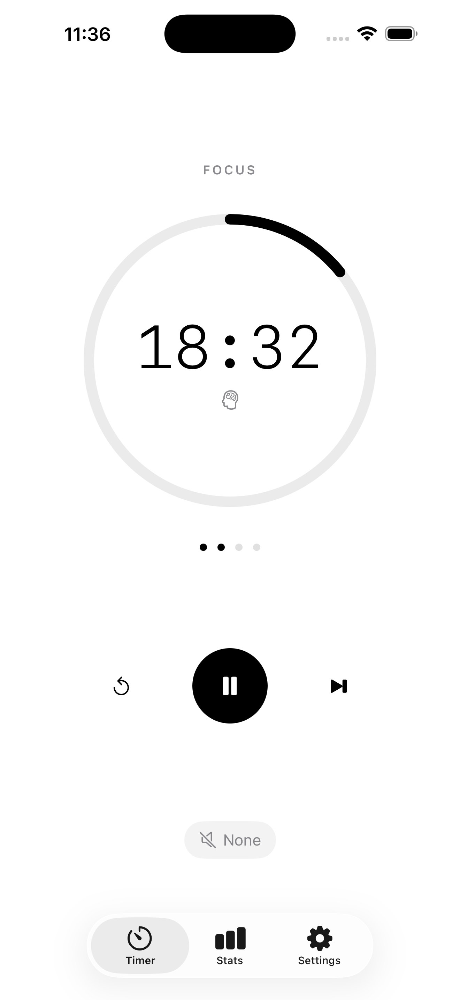
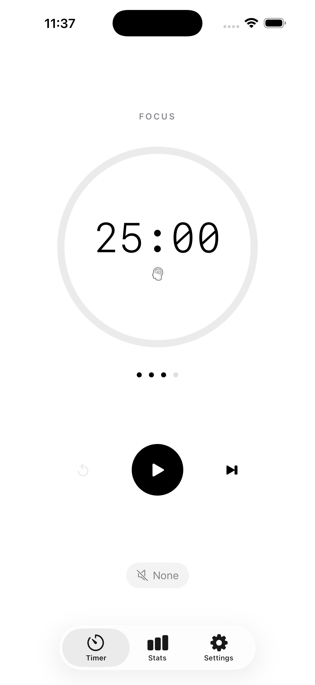
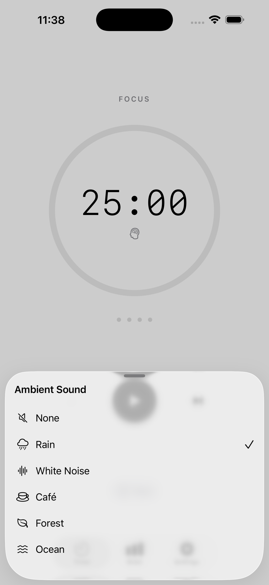
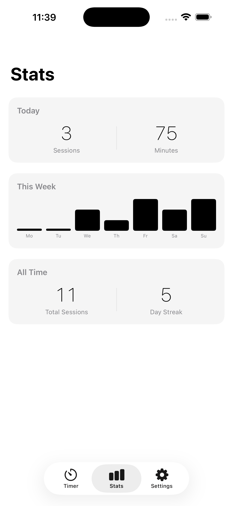
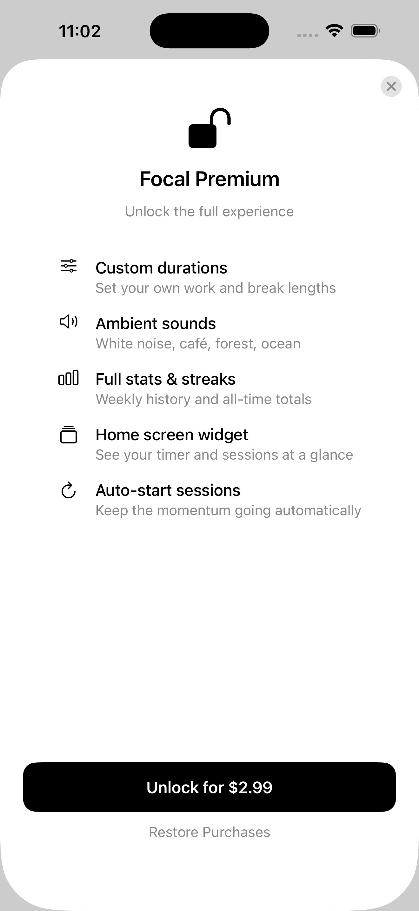

# Focal — Pomodoro Timer

A minimal, focused Pomodoro timer for iOS built with SwiftUI. Stay in deep work with timed sessions, ambient sounds, session tracking, and a home screen widget — all in a clean, distraction-free interface.

<p align="center">
  <a href="https://apps.apple.com/us/app/focal-pomodoro-timer/id6790249507">
    
  </a>
</p>

---

## Screenshots

<p align="center">
  
  
  
  
  
</p>

---

## Features

### Free
- Circular progress timer with standard Pomodoro intervals (25 / 5 / 15 min)
- Work and break phase cycling with long break after every 4 sessions
- Cycle dot indicator showing progress through each round
- Ambient sound — Rain
- Local notifications when sessions and breaks end
- Today's session count and minutes

### Focal Premium — $2.99 one-time purchase
- Custom work and break durations (1–60 min)
- Configurable sessions per cycle (2–8)
- Full ambient sound library — Rain, White Noise, Café, Forest, Ocean
- Auto-start next session
- Full stats history — weekly bar chart, total sessions, day streak
- Home screen widget — small size with live countdown and cycle dots
- Lock screen widgets — circular progress ring and rectangular countdown

---

## Tech Stack

| Concern | Choice |
|---|---|
| UI | SwiftUI (iOS 17+) |
| State | `@Observable` + `@Environment` |
| Persistence | SwiftData |
| Audio | AVFoundation |
| Notifications | UserNotifications |
| Monetization | StoreKit 2 |
| Widget | WidgetKit |
| Min deployment | iOS 17.0 |

---

## Architecture

MVVM with a service layer. A single `TimerService` owns all timer state as an `@Observable` class injected via `@Environment`. Child views observe it directly — no Combine, no manual binding chains.

```
App/                        # Entry point, environment wiring, model container
Features/
  Timer/                    # Core timer UI
  Stats/                    # Session history and charts
  Settings/                 # Durations, sound, behavior
  Paywall/                  # StoreKit purchase sheet
  Onboarding/               # First-launch flow
Models/                     # FocusSession SwiftData model
Services/
  TimerService              # Observable state machine — phase, progress, callbacks
  AudioManager              # AVAudioSession looping playback
  NotificationManager       # UNUserNotificationCenter scheduling
  StoreManager              # StoreKit 2 — purchase, restore, entitlement check
  WidgetDataManager         # Writes shared UserDefaults for widget
UI/
  Components/               # ProBadge, SoundPickerSheet (shared)
Shared/                     # WidgetTimerData — compiled into both targets
FocalWidget/                # WidgetKit extension — small, circular, rectangular
```

---

## Requirements

- Xcode 16+ (developed with Xcode 26)
- iOS 17.0+
- Apple Developer account (for StoreKit and push entitlements)

---

## Building

1. Clone the repo

```bash
git clone https://github.com/MattTripodi/Focal.git
cd Focal
```

2. Open `Focal.xcodeproj` in Xcode

3. Update the App Group identifier in both targets

The App Group is currently set to `group.com.matthewtripodi.focal`. If you build under your own team, update it in:
- **Focal target → Signing & Capabilities → App Groups**
- **FocalWidget target → Signing & Capabilities → App Groups**
- `Services/WidgetDataManager.swift` — `suiteName` constant
- `FocalWidget/FocalWidget.swift` — `suiteName` constant in `storedData()`
- `App/ModelContainer+Focal.swift` — App Group identifier

4. Update the StoreKit product ID

In `Services/StoreManager.swift`, update `premiumProductID` to match your own product ID in App Store Connect (or your local `.storekit` config file).

5. Select the **Focal** scheme and run

StoreKit local testing is pre-configured via `Products.storekit`. Make sure it's linked in **Edit Scheme → Run → Options → StoreKit Configuration** for in-Simulator purchase testing.

---

## Widget Setup

The home screen and lock screen widgets read timer state from a shared `UserDefaults` suite (`group.com.matthewtripodi.focal`). Data is written by `WidgetDataManager` on every timer state change and decoded by `FocalWidgetProvider` on each timeline refresh.

Lock screen widget families supported:
- `.systemSmall` — home screen, shows live countdown and cycle dots
- `.accessoryCircular` — lock screen, circular progress ring with countdown
- `.accessoryRectangular` — lock screen, phase label, countdown, session count

---

## Ambient Sound Files

The following `.mp3` files are required in the **Focal** target bundle:

```
sound_rain.mp3
sound_whitenoise.mp3
sound_cafe.mp3
sound_forest.mp3
sound_ocean.mp3
```

Audio files are not included in this repository. Royalty-free sources:
- [freesound.org](https://freesound.org) — filter by CC0 license
- [pixabay.com/sound-effects](https://pixabay.com/sound-effects/) — no attribution required

---

## License

MIT License. See [LICENSE](LICENSE) for details.

---

<p align="center">
  Built with SwiftUI · <a href="https://apps.apple.com/us/app/focal-pomodoro-timer/id6790249507">Download on the App Store</a>
</p>
